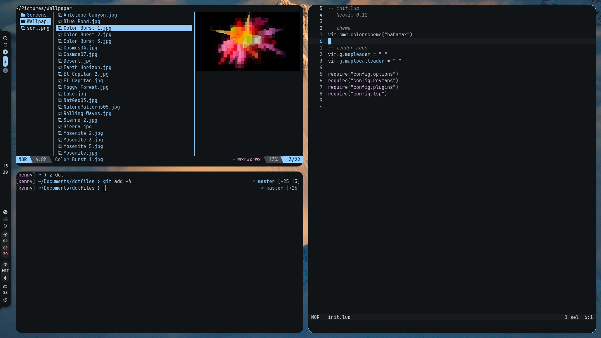

# dotfiles

Personal config files for my setup: **Arch Linux + niri + Noctalia**.



| Category | Tools |
|---|---|
| Desktop | niri, Noctalia, Noctalia Greeter |
| Terminal | Alacritty, zsh, yazi |
| Editor | Helix, Neovim |
| Browser | Zen Browser |

## Install

Pick one method for `.config/`:

**Symlink**:

```sh
cd ~/Documents/dotfiles
for d in .config/*; do ln -sT "$PWD/$d" ~/"$d"; done
```

> [!WARNING]
> `ln` won't overwrite existing configs. Move old ones out of the way first.

**Copy**:

Manually transfer the configurations you need to the folder.

> [!IMPORTANT]
> Files under `etc/` are not covered by either method. Copy them manually.

## Setup

<details>
<summary><b>Noctalia</b> — desktop shell</summary>

```sh
sudo pacman -S noctalia
```

- Put wallpapers in `~/Pictures/Wallpaper`, then change the wallpaper once to generate the theme files.
- Check the config with `noctalia config validate`.

</details>

<details>
<summary><b>niri</b> — compositor</summary>

```sh
sudo pacman -S niri
```

- Edit `local.kdl` to change the monitor setup.
- Check the config with `niri validate`.

</details>

<details>
<summary><b>Noctalia Greeter</b> — login screen</summary>

```sh
paru -S noctalia-greeter
sudoedit /etc/greetd/config.toml   # [default_session] command = "/usr/bin/noctalia-greeter-session"
sudo systemctl disable sddm.service
sudo systemctl enable greetd
```

- Replace `sddm.service` with whatever `systemctl status display-manager.service` shows.
- After rebooting, sync the look in Noctalia: Settings → Security → Noctalia Greeter → **Sync Now**.

</details>

<details>
<summary><b>Alacritty</b> — terminal</summary>

```sh
sudo pacman -S alacritty ttf-jetbrains-mono-nerd
```

</details>

<details>
<summary><b>Zen Browser</b> — browser</summary>

```sh
paru -S zen-browser-bin
```

- Settings → Accessibility → Website contrast → **Automatic (use system settings)**.
- Colors come from Noctalia's `zen-browser` template. Restart Zen after the theme changes.

</details>

<details>
<summary><b>zsh</b> — shell</summary>

```sh
sudo pacman -S zsh
sudo pacman -S zoxide zsh-syntax-highlighting
sudo pacman -S eza bat ripgrep
chsh -s /usr/bin/zsh
```

- Requires `/etc/zsh/zshenv` from this repo (see [Install](#install)).

</details>

<details>
<summary><b>yazi</b> — file manager</summary>

```sh
sudo pacman -S yazi
sudo pacman -S chafa udisks2
ya pkg install
```

- `chafa`: image preview fallback, since Alacritty has no image protocol.
- `udisks2`: required by the `mount` plugin.
- `ya pkg upgrade` updates the packages to their latest versions.

</details>

<details>
<summary><b>Helix</b> — editor</summary>

```sh
sudo pacman -S helix
```

</details>

<details>
<summary><b>Neovim</b> — editor</summary>

```sh
sudo pacman -S neovim
```

</details>

## After updating

Run these after a system upgrade or a config change:

```sh
noctalia config validate
niri validate
```
